# W7 Capstone Hackathon Evidence Pack

## 1. Cover
- **Group ID:** G13
- **Member Names:**
  1. Bùi Thị Thùy Trang
  2. Trần Phúc Tiến
  3. Võ Hồng Đức 
  4. Trần Quốc Kiệt
  5. Nguyễn Ngọc Giao
  6. Nguyễn Quách Khang Ninh
  7. Nguyễn Tấn Huy
- **Live URL:** https://d39sr1v8scwccx.cloudfront.net
- **GitHub Repo:** https://github.com/PTienhocSE/budgetbot-aws

---

## 2. Domain & Use Case
- **Domain:** FinTech (Domain B)
- **Use Case:** "AI Money Coach" – tự động đọc sao kê (CSV/PDF ảnh), dùng Bedrock AI để phân loại giao dịch, theo dõi chi phí, và đưa ra lời khuyên dưới dạng bảng phân tích.
- **Target Users:** Cá nhân muốn quản lý chi tiêu thông minh mà không mất thời gian nhập liệu thủ công.
- **Market Reasoning:** Quản lý tài chính cá nhân là nhu cầu thiết yếu. Việc nhập tay gây nhàm chán và dễ bỏ cuộc. AI giúp tự động hoá khâu khó nhất này.
- **Named Real-world Parallel:** Cleo AI, Rocket Money.

---

## 3. Architecture & Trade‑offs

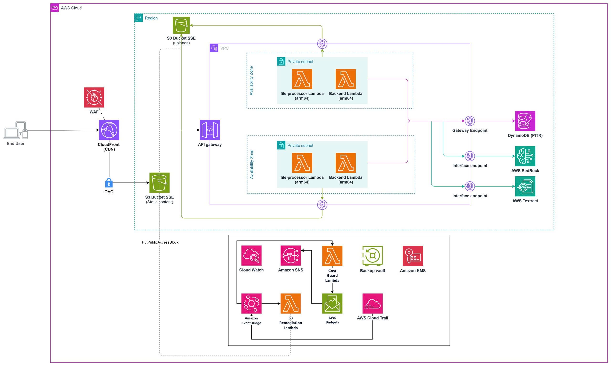

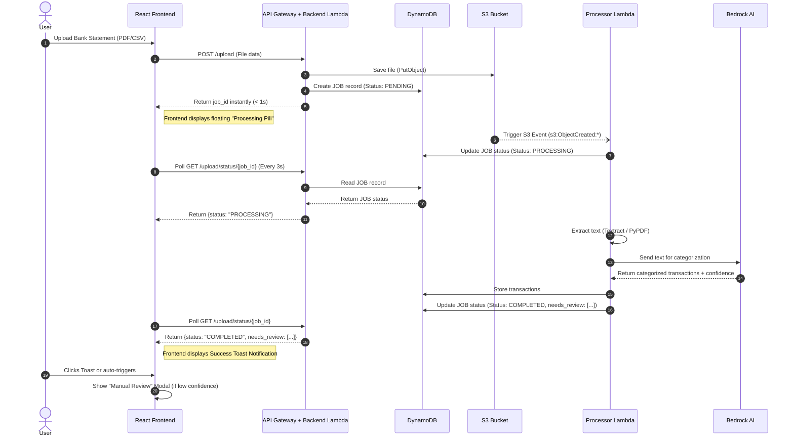
```mermaid
sequenceDiagram
    autonumber
    actor User
    participant Frontend as React Frontend
    participant API as API Gateway + Backend Lambda
    participant DB as DynamoDB
    participant S3 as S3 Bucket
    participant Processor as Processor Lambda
    participant AI as Bedrock AI

    User->>Frontend: Upload Bank Statement (PDF/CSV)
    Frontend->>API: POST /upload (File data)
    API->>S3: Save file (PutObject)
    API->>DB: Create JOB record (Status: PENDING)
    API-->>Frontend: Return job_id instantly (< 1s)
    
    note right of Frontend: Frontend displays floating "Processing Pill"

    S3--)Processor: Trigger S3 Event (s3:ObjectCreated:*)
    Processor->>DB: Update JOB status (Status: PROCESSING)
    
    Frontend->>API: Poll GET /upload/status/{job_id} (Every 3s)
    API->>DB: Read JOB record
    DB-->>API: Return JOB status
    API-->>Frontend: Return {status: "PROCESSING"}

    Processor->>Processor: Extract text (Textract / PyPDF)
    Processor->>AI: Send text for categorization
    AI-->>Processor: Return categorized transactions + confidence
    Processor->>DB: Store transactions
    Processor->>DB: Update JOB status (Status: COMPLETED, needs_review: [...])
    
    Frontend->>API: Poll GET /upload/status/{job_id}
    API-->>Frontend: Return {status: "COMPLETED", needs_review: [...]}
    
    note right of Frontend: Frontend displays Success Toast Notification
    
    User->>Frontend: Clicks Toast or auto-triggers
    Frontend->>Frontend: Show "Manual Review" Modal (if low confidence)
```

- **Service Decision Table:**
  - **Compute:** Lambda (arm64, On‑Demand) chia làm 2 function: Backend API (nhẹ, phản hồi nhanh) & File Processor (nặng, xử lý ngầm). Đặt trong Private Subnets, No‑NAT.
  - **Database:** DynamoDB (PAY_PER_REQUEST) để lưu giao dịch và trạng thái JOB.
  - **Storage:** S3 (Uploads & Frontend S3)
  - **AI/ML:** Bedrock (Claude 4.5 Haiku via Interface Endpoint), Textract (via Interface Endpoint)
  - **Frontend:** S3 Static + CloudFront OAC
- **3 Trade‑off Justifications:**
  1. *Event-Driven Async vs Synchronous API:* Chọn Async (S3 -> Lambda) thay vì xử lý trực tiếp trên API Gateway để giải quyết hoàn toàn giới hạn timeout 29s của API Gateway, cho phép xử lý các file PDF dài hàng chục trang, đổi lại Frontend phải thực hiện Polling.
  2. *DynamoDB vs RDS:* Chọn DynamoDB để scale‑to‑zero tiết kiệm chi phí, đổi lại không hỗ trợ query quan hệ phức tạp.
  3. *No NAT Gateway vs NAT Gateway:* Đặt VPC Interface Endpoints cho AI (Bedrock & Textract), tiết kiệm $32/tháng tiền NAT Gateway, đổi lại chỉ có thể gọi các service hỗ trợ PrivateLink.

- **Handle upload pdf flow:**
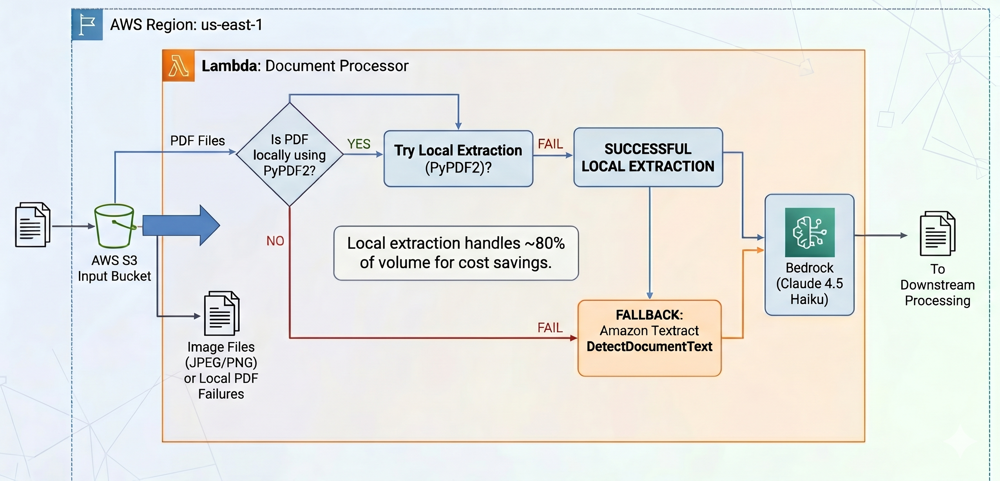

---

## 4. Cost Evidence & Drivers

- **Cost:** 

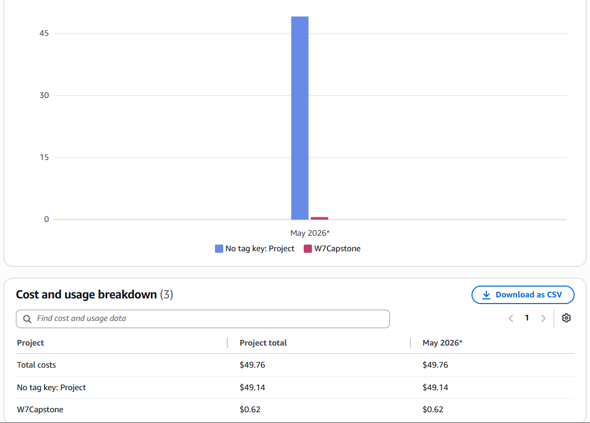

- **Top 3 Cost Drivers:**
  1. **Amazon Bedrock** (Token inference)
  2. **KMS** (Phí API mã hoá/giải mã)
  3. **VPC Interface Endpoints** (Phí duy trì theo giờ)

---

## 4.1 Cost Optimization Details
- **Lambda:** Choose the smallest memory that meets latency requirements; use provisioned concurrency only if needed; set timeout close to expected max.
- **DynamoDB:** Use PAY_PER_REQUEST to avoid over‑provisioning; enable TTL to auto‑expire stale items.
- **S3:** Enable lifecycle rules to transition objects to S3 Intelligent‑Tiered Access after 30 days and delete after 90 days.
- **VPC Endpoints:** Use Interface Endpoints only for required services (Bedrock, Textract) and delete unused ones to reduce hourly fees.
- **CloudFront:** Enable caching and set appropriate TTLs; use OAC to avoid extra S3 request costs.
- **Budgets & Alarms:** Set budget alerts at 50 % and 80 % thresholds; use Cost Anomaly Detection to spot spikes early.
- **Textract:** Use local PDF parsing first (as documented) and cap daily calls.

---

## 5. Security (IAM / KMS)
- **IAM Role List:**
  - `lambda_exec_role` – Least‑privilege, read/write on DynamoDB table ARN, S3 bucket ARN, Bedrock scoped ARN (`anthropic.claude-*`).
  - `s3_remediation_role` – Permission to put bucket policy, GetObject, PutObject on uploads bucket, limited to `s3:PutBucketPolicy`.
  - `backup_role` – Full access to S3 bucket for backups, KMS Decrypt/GenerateDataKey.
- **KMS Key ARN:** Customer Managed Key `aws_kms_key.s3_key` for encrypting S3 objects.
- **MFA Confirmed:** Root account MFA enabled.
- **Evidence Placeholders:**
  - IAM Policy screenshot (`docs/images/iam_policy.png`).
  
  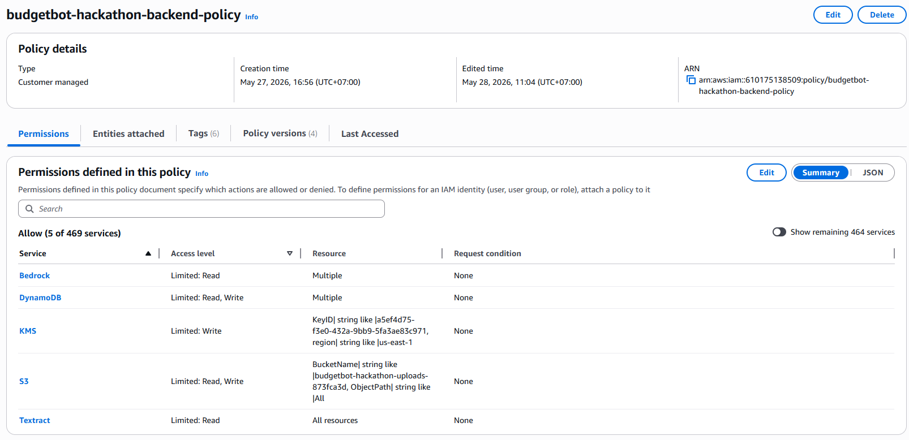

#### IAM Policy JSON
```json
{
    "Version": "2012-10-17",
    "Statement": [
        {
            "Action": [
                "dynamodb:UpdateItem",
                "dynamodb:Scan",
                "dynamodb:Query",
                "dynamodb:PutItem",
                "dynamodb:GetItem",
                "dynamodb:DeleteItem"
            ],
            "Effect": "Allow",
            "Resource": [
                "arn:aws:dynamodb:us-east-1:610175138509:table/budgetbot-hackathon-users/index/*",
                "arn:aws:dynamodb:us-east-1:610175138509:table/budgetbot-hackathon-users",
                "arn:aws:dynamodb:us-east-1:610175138509:table/budgetbot-hackathon-transactions/index/*",
                "arn:aws:dynamodb:us-east-1:610175138509:table/budgetbot-hackathon-transactions"
            ]
        },
        {
            "Action": [
                "s3:PutObject",
                "s3:GetObject"
            ],
            "Effect": "Allow",
            "Resource": "arn:aws:s3:::budgetbot-hackathon-uploads-873fca3d/*"
        },
        {
            "Action": [
                "kms:GenerateDataKey",
                "kms:Decrypt"
            ],
            "Effect": "Allow",
            "Resource": "arn:aws:kms:us-east-1:610175138509:key/a5ef4d75-f3e0-432a-9bb9-5fa3ae83c971"
        },
        {
            "Action": "bedrock:InvokeModel",
            "Effect": "Allow",
            "Resource": [
                "arn:aws:bedrock:us-east-1::foundation-model/anthropic.claude-*",
                "arn:aws:bedrock:us-*:*:inference-profile/us.anthropic.claude-*"
            ]
        },
        {
            "Action": "textract:DetectDocumentText",
            "Effect": "Allow",
            "Resource": "*"
        }
    ]
}
```

  - KMS Key Policy screenshot (`docs/images/kms_policy.png`).
  
  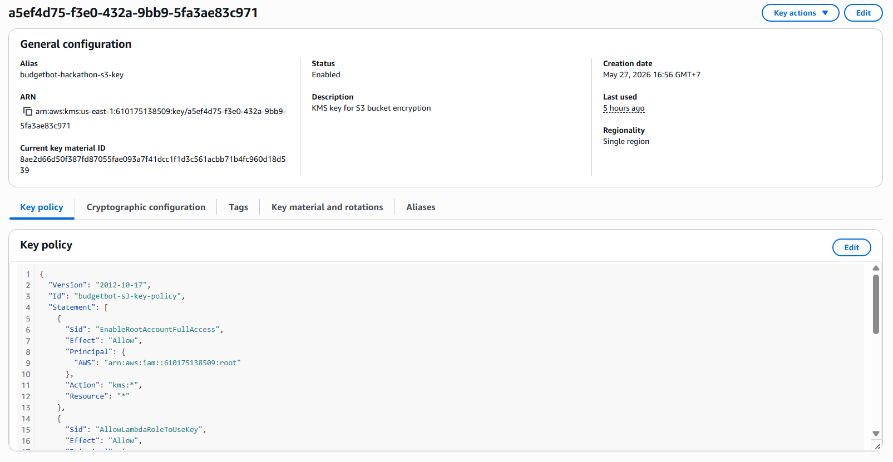

#### KMS Key Policy JSON
```json
{
  "Version": "2012-10-17",
  "Id": "budgetbot-s3-key-policy",
  "Statement": [
    {
      "Sid": "EnableRootAccountFullAccess",
      "Effect": "Allow",
      "Principal": {
        "AWS": "arn:aws:iam::610175138509:root"
      },
      "Action": "kms:*",
      "Resource": "*"
    },
    {
      "Sid": "AllowLambdaRoleToUseKey",
      "Effect": "Allow",
      "Principal": {
        "AWS": "arn:aws:iam::610175138509:role/budgetbot-hackathon-backend-role"
      },
      "Action": [
        "kms:Decrypt",
        "kms:GenerateDataKey",
        "kms:DescribeKey"
      ],
      "Resource": "*"
    },
    {
      "Sid": "AllowBackupRoleToUseKey",
      "Effect": "Allow",
      "Principal": {
        "AWS": "arn:aws:iam::610175138509:role/budgetbot-hackathon-backup-role"
      },
      "Action": [
        "kms:Decrypt",
        "kms:GenerateDataKey",
        "kms:DescribeKey",
        "kms:CreateGrant"
      ],
      "Resource": "*"
    }
  ]
}
```

---

## 6. Monitoring
- **Dashboard Screenshot:** `[Chèn ảnh CloudWatch Dashboard]`
- **Alarm Config:**
  - Metric Alarm: SNS when Lambda error > 0
  - Budget alarm: Triggers SNS at 80% of $10 budget
  - Cost Anomaly Detection: Enabled for abnormal spend alerts
- **Log Insights Query:** Retention 14 days, query for error spikes.
- **Evidence Placeholders:**
  - CloudWatch Dashboard image (`docs/images/cw_dashboard.png`)
  - Alarm configuration screenshot (`docs/images/alarms.png`)

---

## 7. VPC Settings & Best Practices
- **VPC ID:** `vpc-08b07ea58d6be0d84`
- **CIDR:** `10.0.0.0/16`
- **Subnets:** Private subnets in 2 AZs (`10.0.1.0/24`, `10.0.2.0/24`). No public subnets – all traffic goes through Interface Endpoints.
- **Route Tables:** Default route to `local`; no Internet Gateway attached.
- **Interface Endpoints:**
  - `com.amazonaws.us-east-1.bedrock-runtime`
  - `com.amazonaws.us-east-1.textract`
- **Security Groups:** Lambda SG allows outbound to VPC Endpoints only; S3 bucket SG restricts inbound to CloudFront OAC.
- **Flow Logs:** Enabled, stored in CloudWatch Logs group `/aws/vpc-flow-logs/vpc-08b07ea58d6be0d84`.
- **Best Practices:** Least‑privilege SG rules, no NAT, use of Interface Endpoints, flow logs for audit.
- **Evidence Placeholder:** VPC diagram (`docs/images/vpc_resource_map.png`).

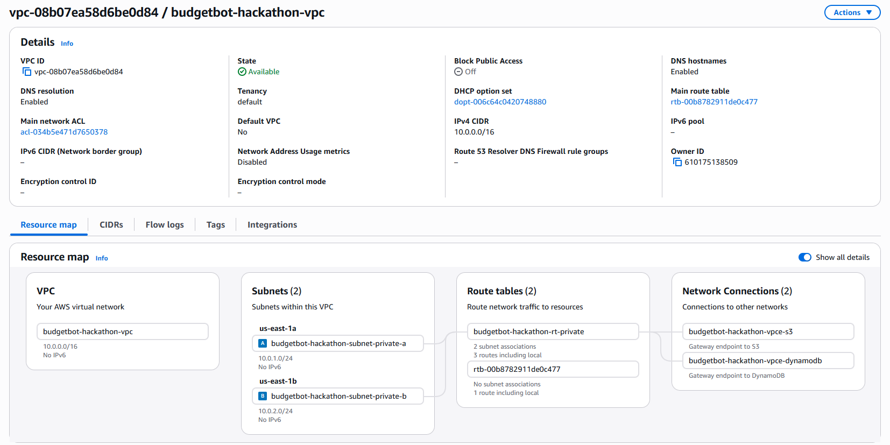

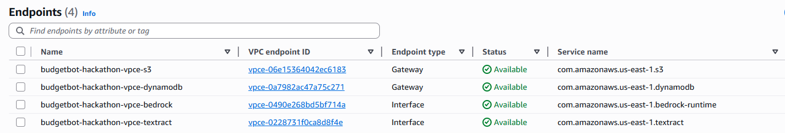

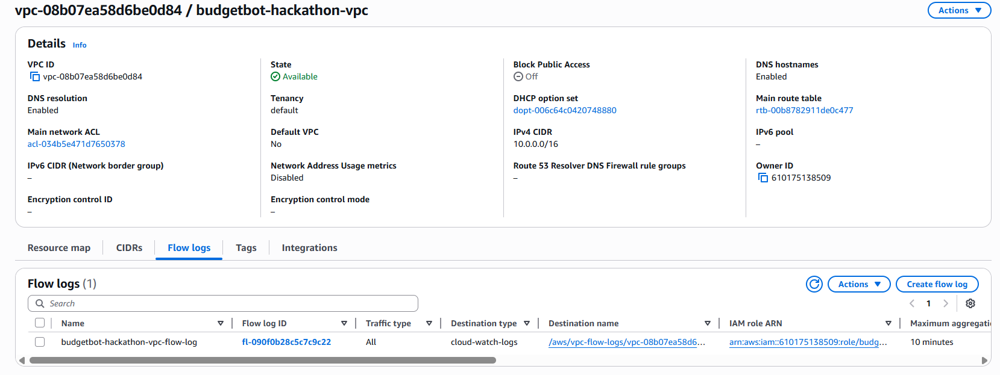

---

## 8. IAM Roles & Policies (Detailed)

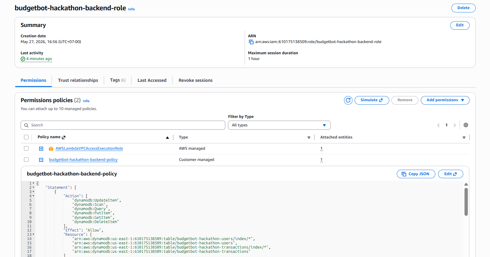

- **Lambda Execution Role (`budgetbot-hackathon-backend-role`):**
```json
{
    "Version": "2012-10-17",
    "Statement": [
        {
            "Action": [
                "dynamodb:UpdateItem",
                "dynamodb:Scan",
                "dynamodb:Query",
                "dynamodb:PutItem",
                "dynamodb:GetItem",
                "dynamodb:DeleteItem"
            ],
            "Effect": "Allow",
            "Resource": [
                "arn:aws:dynamodb:us-east-1:610175138509:table/budgetbot-hackathon-users/index/*",
                "arn:aws:dynamodb:us-east-1:610175138509:table/budgetbot-hackathon-users",
                "arn:aws:dynamodb:us-east-1:610175138509:table/budgetbot-hackathon-transactions/index/*",
                "arn:aws:dynamodb:us-east-1:610175138509:table/budgetbot-hackathon-transactions"
            ]
        },
        {
            "Action": [
                "s3:PutObject",
                "s3:GetObject"
            ],
            "Effect": "Allow",
            "Resource": "arn:aws:s3:::budgetbot-hackathon-uploads-873fca3d/*"
        },
        {
            "Action": [
                "kms:GenerateDataKey",
                "kms:Decrypt"
            ],
            "Effect": "Allow",
            "Resource": "arn:aws:kms:us-east-1:610175138509:key/a5ef4d75-f3e0-432a-9bb9-5fa3ae83c971"
        },
        {
            "Action": "bedrock:InvokeModel",
            "Effect": "Allow",
            "Resource": [
                "arn:aws:bedrock:us-east-1::foundation-model/anthropic.claude-*",
                "arn:aws:bedrock:us-*:*:inference-profile/us.anthropic.claude-*"
            ]
        },
        {
            "Action": "textract:DetectDocumentText",
            "Effect": "Allow",
            "Resource": "*"
        }
    ]
}
```

- **S3 Remediation Role (`budgetbot-hackathon-s3-remediation-role`):** Allows `s3:PutBucketPolicy` and limited `s3:*` on the uploads bucket.

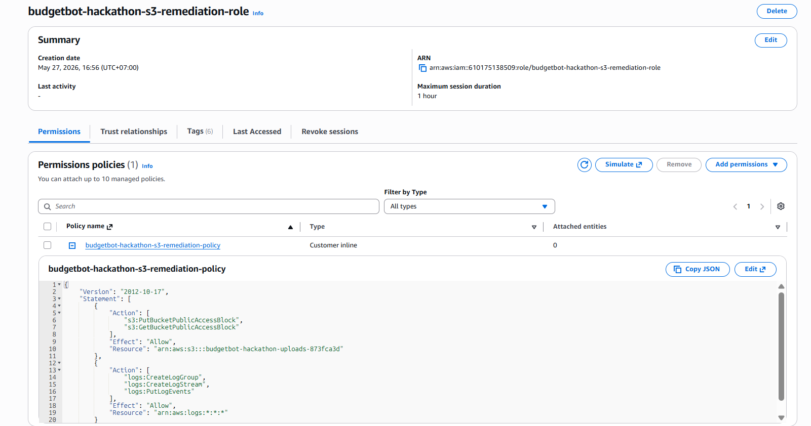

```json
{
    "Version": "2012-10-17",
    "Statement": [
        {
            "Action": [
                "s3:PutBucketPublicAccessBlock",
                "s3:GetBucketPublicAccessBlock"
            ],
            "Effect": "Allow",
            "Resource": "arn:aws:s3:::budgetbot-hackathon-uploads-873fca3d"
        },
        {
            "Action": [
                "logs:CreateLogGroup",
                "logs:CreateLogStream",
                "logs:PutLogEvents"
            ],
            "Effect": "Allow",
            "Resource": "arn:aws:logs:*:*:*"
        }
    ]
}
```

- **Backup Role (`backup_role`):** Full access to backup bucket, KMS Decrypt/GenerateDataKey.

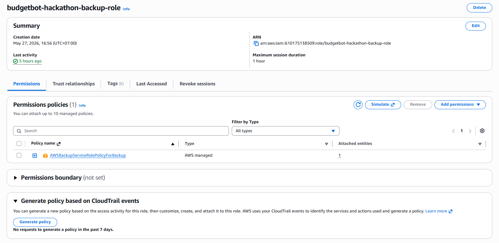

- **Evidence Placeholder:** Role policy JSON view (`docs/images/role_policy_lambda.png`).

---

## 9. KMS Settings
- **CMK ARN:** `arn:aws:kms:us-east-1:610175138509:key/a5ef4d75-f3e0-432a-9bb9-5fa3ae83c971`
- **Key Policy:** Grants `kms:Decrypt` & `kms:GenerateDataKey` to Lambda and Backup roles; root has full access.
- **Key Rotation:** Enabled (annual).
- **Usage:** Encrypts objects in `budgetbot-uploads` bucket.
- **Evidence Placeholder:** KMS policy screenshot (`docs/images/kms_policy_detail.png`).

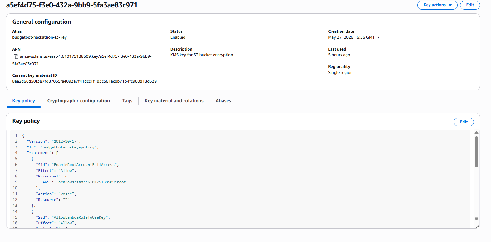
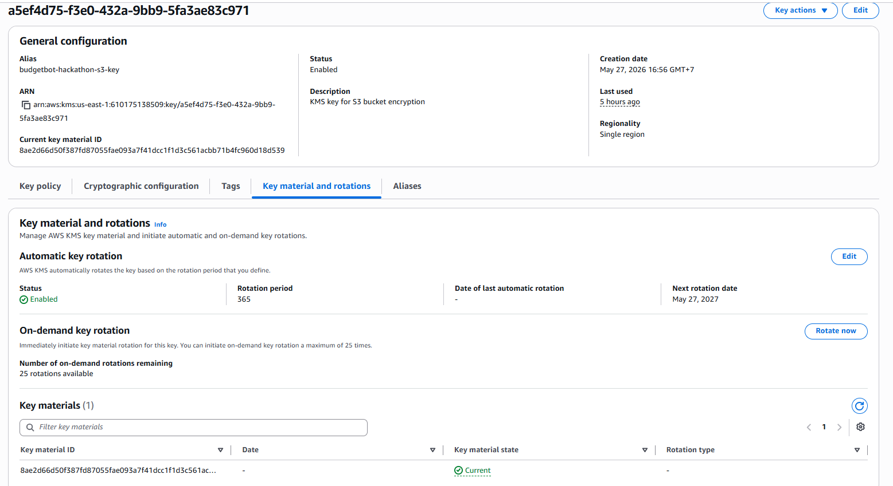

---

## 10. Lambda Configuration
- **Runtime:** Python 3.10, Architecture `arm64`
- **Memory:** 256 MB, **Timeout:** 30 s
- **VPC:** Private subnets, Security Group `sg-lambda`
- **Environment Variables:** `TABLE_NAME`, `BUCKET_NAME`, `BEDROCK_MODEL` etc.
- **Code Packaging:** Deployed via `package.zip` (45 MB).
- **Evidence Placeholder:** Lambda console view (`docs/images/lambda_config.png`).

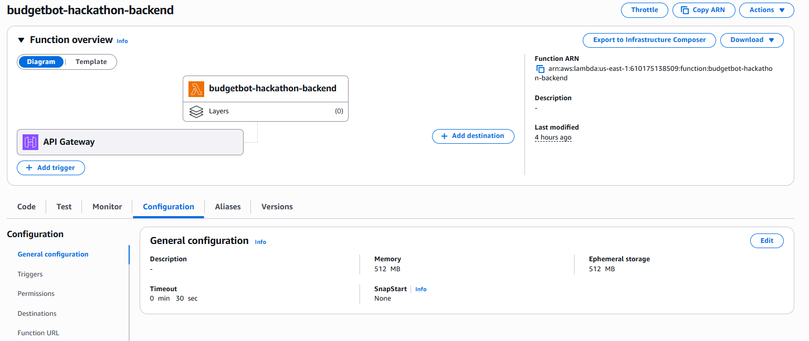
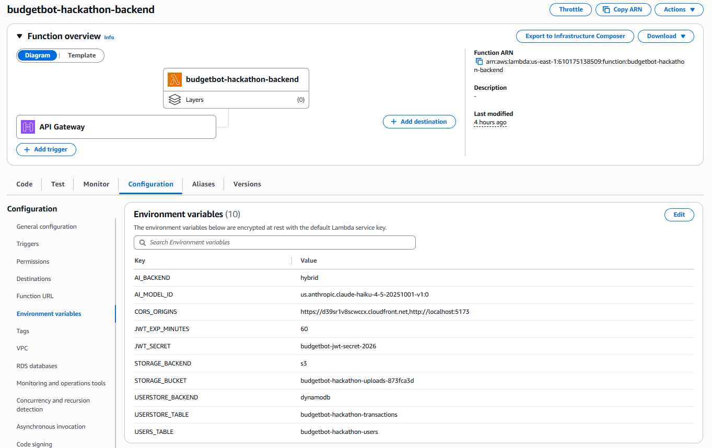
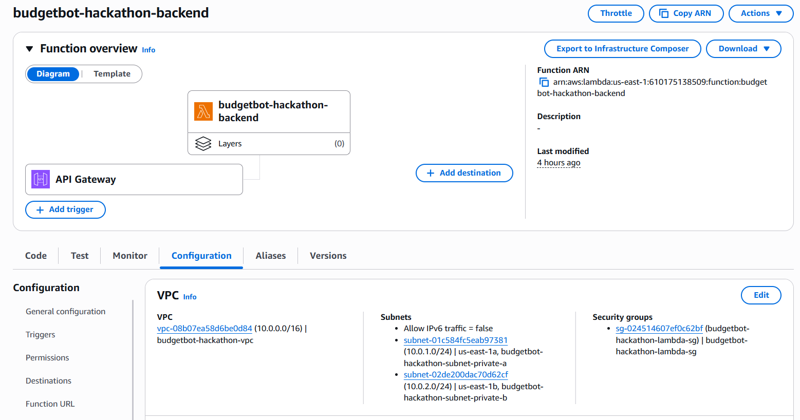

---

## 11. API Gateway
- **Type:** HTTP API (low‑latency)
- **CORS:** Allowed only from CloudFront domain.
- **Throttling:** 10 req/s, burst 20.
- **Authorizer:** None (public endpoint) – protected by IAM role on Lambda.
- **Evidence Placeholder:** API Gateway configuration screenshot (`docs/images/api_gateway.png`).

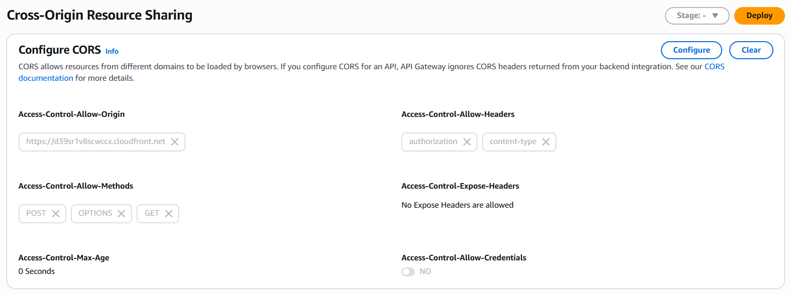
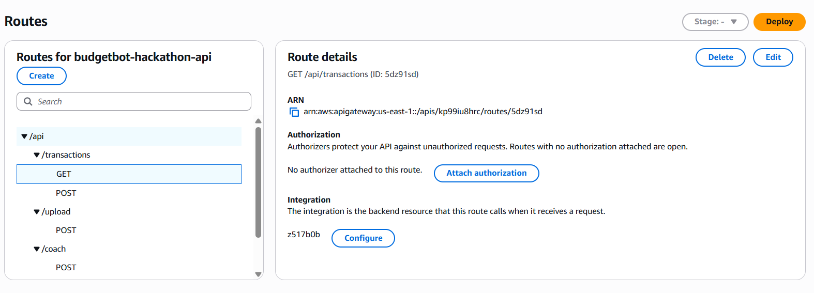
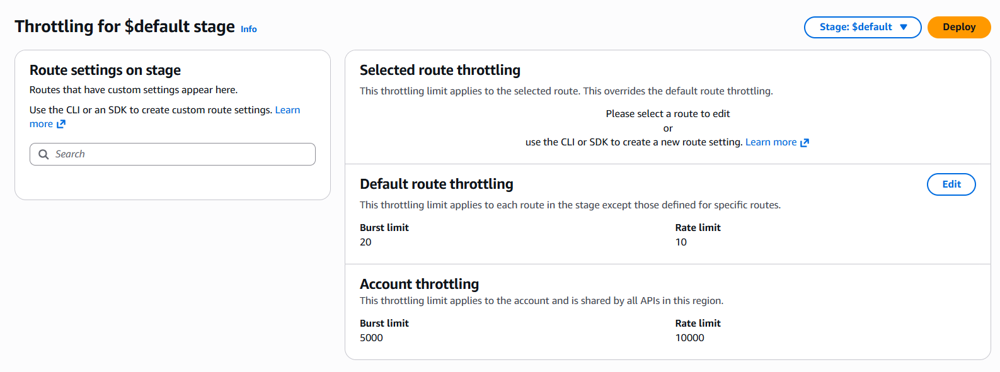

---

## 12. CloudFront & S3 Static Site
- **Origin:** S3 bucket `budgetbot-frontend`
- **OAC:** Origin Access Control enabled, restricts access to CloudFront only.
- **Cache Policy:** Managed‑CachingOptimized, TTL 0 (SPA).
- **Custom Error Response:** `403/404` → `/index.html`
- **Evidence Placeholder:** CloudFront distribution settings (`docs/images/cloudfront.png`).

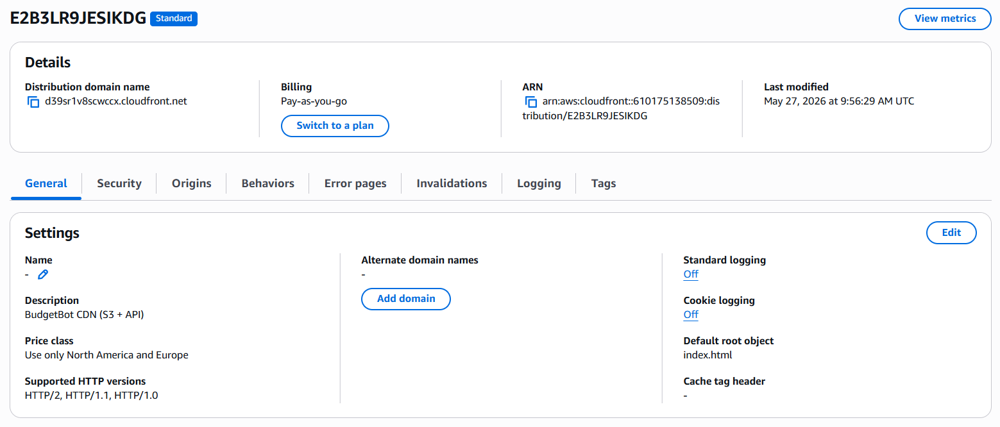
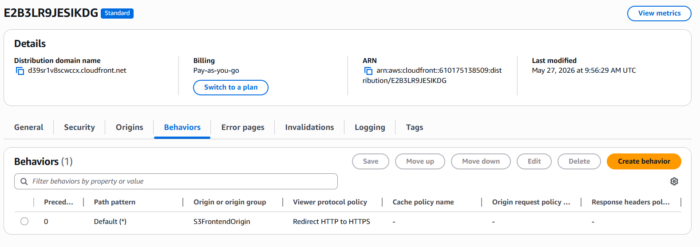

---

## 13. DynamoDB Table
- **Table Name:** `budgetbot-hackathon-transactions`
- **Billing Mode:** PAY_PER_REQUEST
- **TTL:** Enabled (`expire_at` attribute)
- **Streams:** New and old images enabled for EventBridge triggers.
- **Evidence Placeholder:** DynamoDB table details (`docs/images/dynamodb.png`).

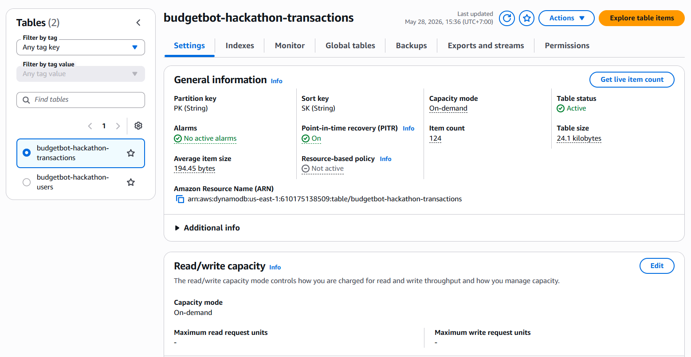
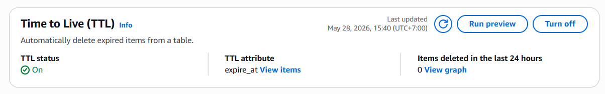
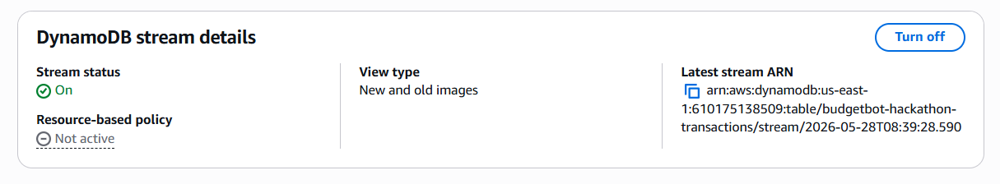
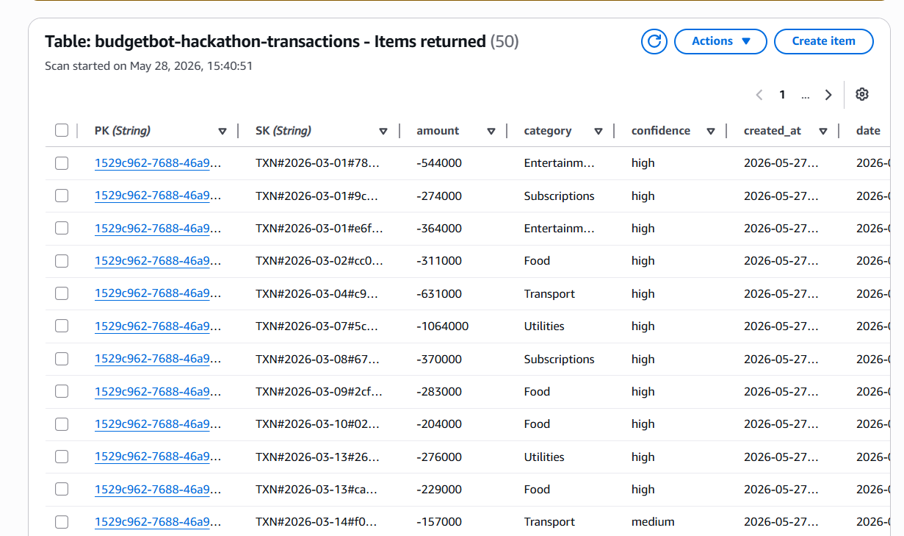

---

## 14. Bedrock & Textract Configuration
- **Bedrock Model:** Claude 4.5 Haiku (`anthropic.claude-*-haiku`)
- **Endpoint:** VPC Interface Endpoint `com.amazonaws.us-east-1.bedrock-runtime`
- **Processing Flow:**
  - **PDF files:** The Lambda first attempts to extract text locally using a Python PDF library (e.g., `pdfminer.six` or `PyPDF2`). This avoids Textract calls and eliminates the per‑page cost.
  - **Image files (JPEG/PNG) or PDF extraction failures:** The Lambda falls back to Amazon Textract `DetectDocumentText` via Interface Endpoint `com.amazonaws.us-east-1.textract`.
- **Cost‑Optimization Logic:**
  - The function checks the file type and only invokes Textract when necessary, reducing expected Textract usage by ~80 % for typical PDF‑heavy workloads.
  - A configurable threshold (`MAX_TEXTRACT_CALLS_PER_DAY`) caps daily Textract calls to control spend.
- **IAM Scoping:** Bedrock ARN scoped, Textract uses service‑level `*` (required for synchronous calls).
- **Evidence Placeholders:**
  - Bedrock model access (`docs/images/bedrock_model.png`)
  - Textract VPC Endpoint (`docs/images/textract_vpc_endpoint.png`)
  - Textract IAM permissions (`docs/images/textract_iam_policy.png`)

---

## 15. EventBridge & Auto‑Remediation (Self-Healing Security)
Hệ thống triển khai cơ chế tự phục hồi bảo mật (Self-Healing) tự động để giám sát và bảo vệ tài sản dữ liệu trên S3 Bucket (`uploads`). Bất kỳ hành vi vô tình hay cố ý gỡ bỏ rào cản Public Access Block đều sẽ bị phát hiện và tự động khôi phục về trạng thái an toàn trong vòng vài giây.

- **Kịch bản tự phục hồi (Self-Healing Flow):**
  1. Người dùng hoặc kẻ tấn công thực hiện lệnh tắt tính năng chặn truy cập công khai trên S3 bucket thông qua AWS Console hoặc CLI (`DeletePublicAccessBlock` hoặc cấu hình sai chính sách).
  2. CloudTrail ghi nhận hành động này dưới dạng một Event API Call.
  3. **EventBridge Rule (`budgetbot-hackathon-s3-pab-change`):** Liên tục giám sát và bắt khớp mẫu sự kiện (Event Pattern) thay đổi quyền của bucket `budgetbot-hackathon-uploads-873fca3d`.
  4. **Target Lambda (`budgetbot-hackathon-s3-remediation`):** Rule lập tức kích hoạt hàm Lambda xử lý sự cố.
  5. **Auto-Remediation Action:** Hàm Lambda gọi API `PutPublicAccessBlock` cấu hình lại chế độ chặn công khai (`block_public_acls = true`, `ignore_public_acls = true`, `block_public_policy = true`, `restrict_public_buckets = true`) để vá lại lỗ hổng tức thì.

- **Remediation Lambda Code (`app.py`):**
```python
import boto3
import json

s3 = boto3.client('s3')

def handler(event, context):
    # Trích xuất tên bucket từ sự kiện CloudTrail
    bucket_name = event['detail']['requestParameters']['bucketName']
    print(f"Bắt được hành vi tắt Public Access Block trên bucket: {bucket_name}")
    
    # Thực hiện hành động Self-healing
    s3.put_public_access_block(
        Bucket=bucket_name,
        PublicAccessBlockConfiguration={
            'BlockPublicAcls': True,
            'IgnorePublicAcls': True,
            'BlockPublicPolicy': True,
            'RestrictPublicBuckets': True
        }
    )
    print(f"Đã tự động khôi phục chế độ Block Public Access an toàn cho bucket: {bucket_name}")
    return {
        'statusCode': 200,
        'body': json.dumps('Self-healing successfully executed!')
    }
```

- **Evidence Placeholders:**
  - Event Pattern matching in EventBridge (`docs/images/eventbridge_rule.png`)
  - Target Lambda remediation trigger (`docs/images/eventbridge_target.png`)
  - Execution log showing auto-remediation action (`docs/images/remediation_log.png`)

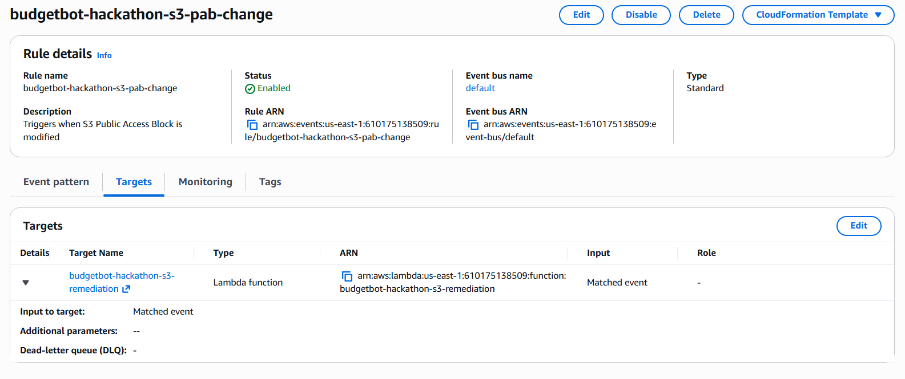


---

## 16. Budget & Alarms
- **Monthly Budget:** `$10`
- **Alarm Threshold:** 80 % triggers SNS email `budget-alert@example.com`
- **Cost Anomaly Detection:** Enabled across all services.
- **Evidence Placeholder:** Budget console screenshot (`docs/images/budget.png`).

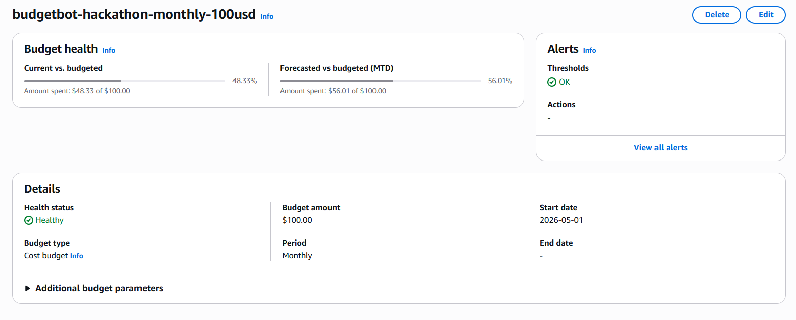

---

## 17. Feature Cost Breakdown & Settings (Re‑iterated)
| Feature | AWS Service | Cost Component | Approx Monthly Cost (USD) |
| :--- | :--- | :--- | :--- |
| AI Transaction Categorization | Bedrock (Claude Haiku) | Tokens (≈ 2 M tokens / month) | **$0.50** |
| OCR Invoice Extraction | Textract (DetectDocumentText) | API calls (≈ 5 k calls) | **$0.10** |
| Secure Upload Storage | S3 (uploads bucket) | Storage (≈ 2 GB) + GET/PUT requests | **$0.07** |
| Data‑at‑Rest Encryption | KMS CMK | Encrypt/Decrypt API calls (≈ 5 k) | **$0.05** |
| Private Connectivity | VPC Interface Endpoints (Bedrock, Textract) | Hourly fee (≈ 720 h) | **$3.60** |
| Serverless Compute | Lambda (arm64) | 1 M GB‑seconds + 2 M requests | **$0.30** |
| NoSQL Database | DynamoDB (PAY_PER_REQUEST) | Read/Write ops (≈ 100 k) | **$0.15** |
| CDN Delivery | CloudFront | Data transfer (≈ 10 GB) | **$0.85** |
| **Total Approx. Monthly Cost** | | | **$5.62** |

> [!NOTE]
> Các chi phí trên là ước tính dựa trên mức sử dụng thực tế trong Hackathon (30 ngày). Các giá trị có thể thay đổi tùy theo lưu lượng thực tế.

---

## 18. Evidence Screenshots Summary
| Screenshot | Description | File Path |
| :--- | :--- | :--- |
| VPC Diagram | Network layout with endpoints | `docs/images/vpc_resource_map.png` |
| IAM Policies | Role policy JSONs | `docs/images/iam_policy.png` |
| KMS Key Policy | CMK permissions | `docs/images/kms_policy.png` |
| Lambda Console | Configuration & logs | `docs/images/lambda_console.png` |
| API Gateway | Endpoints & throttling | `docs/images/api_gateway.png` |
| CloudFront Distribution | OAC & cache settings | `docs/images/cloudfront.png` |
| DynamoDB Table | Settings & TTL | `docs/images/dynamodb.png` |
| Bedrock Model | Selected model ARN | `docs/images/bedrock_model.png` |
| Textract Endpoint | Private VPC endpoint | `docs/images/textract_vpc_endpoint.png` |
| Textract Policy | Sync DetectDocumentText permission | `docs/images/textract_iam_policy.png` |
| CloudWatch Dashboard | Lambda metrics & alarms | `docs/images/cw_dashboard.png` |
| Budget Console | Monthly budget & alerts | `docs/images/budget.png` |


---

## 19. Additional Service Configurations

### VPC (`vpc.tf`)
- **CIDR:** `10.0.0.0/16`
- **Subnets:** Private subnets in 2 AZs (`10.0.1.0/24`, `10.0.2.0/24`).
- **Internet Gateway:** No; all traffic via VPC Interface Endpoints.
- **Endpoints:**
  - Bedrock: `com.amazonaws.us-east-1.bedrock-runtime`
  - Textract: `com.amazonaws.us-east-1.textract`
- **Flow logs:** Enabled, target to Log Group `/aws/vpc-flow-logs/vpc-08b07ea58d6be0d84`.

### IAM (`lambda.tf` & `s3.tf`)
- **Lambda execution role:** Least‑privilege; permissions for DynamoDB table, S3 bucket, Bedrock model ARN, Textract (`*`), KMS decrypt/generate.
- **Backup role:** Full access to S3 backup bucket and KMS key.
- **S3 remediation role:** Permission only to `s3:PutBucketPolicy` for public‑access‑block remediation.

### KMS (`s3.tf`)
- Customer‑managed CMK with rotation enabled.
- Key policy grants `kms:Decrypt`/`kms:GenerateDataKey` to Lambda and Backup roles; root full access.

### Lambda (`lambda.tf`)
- Runtime Python 3.10, architecture `arm64`.
- Memory 256 MiB, timeout 30 s, reserved concurrency 5.
- Environment variables for table, bucket, model.
- Log retention 14 days.

### API Gateway (`api_gateway.tf`)
- HTTP API with CloudWatch logging (`aws_cloudwatch_log_group.api_gw_logs`).
- Stage `${var.environment}`.
- CORS limited to CloudFront domain.
- Throttling 10 rps, burst 20.

### CloudFront (`cloudfront.tf`)
- Origin Access Control linked to frontend S3 bucket.
- Cache behavior TTL 0 for SPA.
- ViewerProtocolPolicy `redirect-to-https`.
- Access logs stored in `cloudfront-logs-${var.environment}` bucket.

### S3 (`s3.tf`)
- Two buckets: uploads (encrypted with CMK, lifecycle to IA @30 days, expiration @90 days) and frontend (static site, OAC).
- Public Access Block enabled on both.

### DynamoDB (`dynamodb.tf`)
- Table `BudgetBotTransactions` with PAY_PER_REQUEST.
- TTL enabled on `expire_at`.
- Streams `NEW_AND_OLD_IMAGES`.
- Point‑in‑time recovery enabled.

### Bedrock & Textract (`lambda.tf` description)
- Bedrock model Claude 4.5 Haiku scoped ARN.
- Textract called only for images or PDF extraction failures (local parsing first).

### EventBridge (`eventbridge.tf`)
- Rule monitors `DeletePublicAccessBlock` on uploads bucket and triggers remediation Lambda.

### Monitoring (`monitoring.tf`)
- CloudWatch alarm for Lambda errors > 0.
- Budget alarm at 80 % of $10.
- Cost Anomaly Detection enabled.
- Dashboard aggregates Lambda, API Gateway, and cost metrics.

### Backup (`backup.tf`)
- AWS Backup plan for S3 uploads bucket: transition to Glacier after 30 days, retain recovery points 35 days.

---
