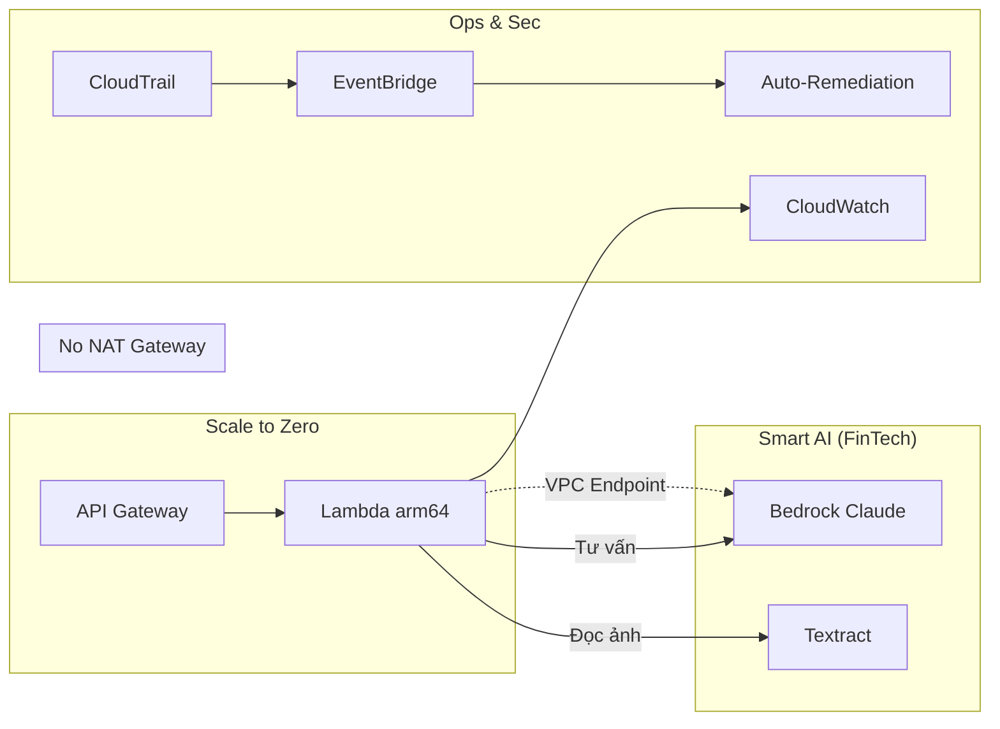

# W7 — Nền tảng Serverless & AI (Đọc file này TRƯỚC)

> Nếu bạn mới tiếp cận AWS hoặc chưa rõ tại sao lại bỏ ECS Fargate để dùng Lambda, **bắt đầu tại đây**.  
> Cẩm nang này được biên soạn dành riêng cho dự án **BudgetBot (W7 Capstone)**.

---

## 1. Tuần 7 là gì? (Một câu)

**Tuần 7 = Cuộc cách mạng Serverless & Tích hợp AI AI Money Coach (FinTech): dọn dẹp máy chủ cồng kềnh, đưa AI vào đọc hóa đơn, phân tích tài chính với chi phí gần như bằng KHÔNG khi không ai dùng.**

Chúng ta sẽ đập bỏ ECS (vốn chạy 24/7) và thay bằng kiến trúc "Scale to Zero" 100% bằng AWS Lambda, đồng thời tích hợp **AWS Textract** và **Amazon Bedrock**.

---

## 2. So sánh Kiến trúc (W6 vs W7)

| Thành phần | Kicks-Shoes (W6) | BudgetBot (W7) | Lý do thay đổi |
|------|-------------------|--------|--------|
| **Compute** | ECS Fargate (x86_64) | AWS Lambda (arm64) | Lambda tự động tắt (Scale to 0) khi không có request. Chuyển sang chip ARM64 (Graviton2) tiết kiệm thêm 20% tiền! |
| **Database** | MongoDB / RDS | DynamoDB (Pay-per-request) | Rẻ hơn, cực kỳ phù hợp với Serverless, không tốn phí duy trì giờ. |
| **Network** | Có NAT Gateway ($32/tháng) | **KHÔNG DÙNG** NAT Gateway | Đổi sang dùng **VPC Interface/Gateway Endpoints** để gọi AI. Tiết kiệm 100% chi phí mạng ngoài! |
| **AI/ML** | Không có | Textract + Bedrock (Claude Haiku) | AI chính là linh hồn của Capstone W7. Textract đọc ảnh sao kê, Bedrock làm cố vấn tài chính. |

W7 **đập đi xây lại hạ tầng cốt lõi** — chuyển từ mô hình "thuê căn hộ trả tiền tháng" sang "thuê khách sạn tính tiền theo phút".

---

## 3. AWS tính tiền thế nào ở W7? (Bài toán chi phí)

Ở W7, mục tiêu tối thượng là tiết kiệm tiền để sống sót qua Hackathon ($100 budget).

| Kiểu | Nghĩa | Nhóm mình dùng ở đâu? |
|------|--------|-------------------|
| **Theo lần gọi (Requests)** | Tính bằng Mili-giây (ms) | **Lambda**: Ai bấm nút thì mới tính tiền. Không bấm = $0. |
| **Theo Token (AI)** | Chữ đầu vào/đầu ra | **Bedrock**: Dùng Claude 4.5 Haiku giá rẻ gấp 15 lần Sonnet. |
| **Theo trang (Pages)** | Số trang OCR | **Textract**: Quét bao nhiêu trang hóa đơn tính bấy nhiêu tiền. |
| **Theo dung lượng** | GB lưu trữ | **DynamoDB, S3**: Lưu ít tính ít. |

**Bí quyết W7:** Nhờ cắt bỏ NAT Gateway và ECS, chi phí cố định (Fixed Cost) của nhóm mình hàng tháng gần như bằng $0!

---

## 4. Bốn trụ cột W7 — Dễ hiểu như đời thường

| Trụ | Cải tiến W7 | Nếu không làm thì sao? |
|-----|------------------|-------------------|
| **Serverless** | Dùng Lambda thay ECS | Tối ngủ máy chủ vẫn chạy, sáng dậy "cháy" thẻ tín dụng. |
| **No-NAT** | Dùng VPC Endpoints | Mất trắng $32/tháng cho NAT Gateway dù không ai xài app. |
| **Smart AI** | Bedrock AI Coach | App vô dụng, chỉ là app ghi chép thu chi bình thường. |
| **Auto-Remediation** | Tự động khóa S3 Public | Bị trừ điểm bảo mật nặng, lộ dữ liệu tài chính của khách hàng. |

---

## 5. Thuật ngữ MỚI quan trọng ở W7

| Thuật ngữ | Định nghĩa dễ hiểu | Ví von |
|-----------|-------------------|--------|
| **VPC Interface Endpoint** | Đường ống ngầm kết nối Lambda với Bedrock/Textract mà không cần Internet. | Đường hầm bí mật nối từ hầm nhà ra ngân hàng, không đi qua mặt đường. |
| **AWS Textract** | Dịch vụ bóc tách chữ từ hình ảnh (OCR) của AWS. | Cô thư ký ngồi gõ lại chữ từ tờ hóa đơn. |
| **Amazon Bedrock** | Cổng tổng hợp các AI xịn nhất (Claude, Llama...). | Bộ não thông thái (ChatGPT phiên bản bảo mật của doanh nghiệp). |
| **arm64 (Graviton2)** | Dòng chip do AWS tự sản xuất, chạy mát hơn, rẻ hơn. | Động cơ xe máy Hybrid thay vì xăng truyền thống. |
| **DynamoDB PITR** | Point-in-time Recovery (khôi phục dữ liệu ở bất kỳ giây nào trong 35 ngày qua). | Máy tính bảng có nút "Undo" thần thánh. |

---

## 6. Luồng bảo mật tự động sửa lỗi (Auto-Remediation)

*Đây là tính năng "ăn điểm" cực mạnh của nhóm mình.*

1. Admin **vô tình** (hoặc cố ý) tắt tính năng *Block Public Access* của S3 Uploads (để lộ hình ảnh hóa đơn của khách).
2. Camera an ninh **CloudTrail** chụp lại hành động này ngay lập tức.
3. Hệ thống báo động **EventBridge** nhận tín hiệu từ CloudTrail.
4. Nó đánh thức **S3 Remediation Lambda**.
5. Lambda này ngay lập tức thực thi quyền hạn khẩn cấp, **bật lại 4 ổ khóa (PutPublicAccessBlock)** của S3.
6. Kết quả: Lỗ hổng bị bịt lại trong vòng vài giây mà con người không cần can thiệp!

---

## 7. Lộ trình đọc đề xuất cho W7

| Bước | File | Thời gian ước tính |
|------|------|-------------------|
| 1 | **w7_foundations.md** (file này) | 10 phút |
| 2 | `W7_evidence.md` | Đọc để hiểu nhóm sẽ chụp ảnh chứng minh gì. |
| 3 | `AWS_Best_Practices_Summary.md` | Các câu trả lời phỏng vấn (Grill) với Mentor. |
| 4 | Xem lại sơ đồ kiến trúc Draw.io / Mermaid | 10 phút |

Khi nắm vững các khái niệm trên, bạn đã hoàn toàn tự tin bảo vệ Capstone W7!
